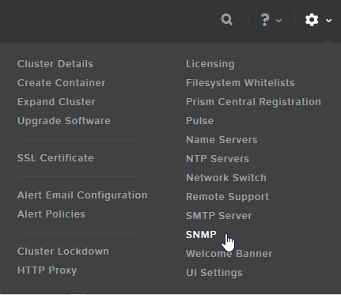
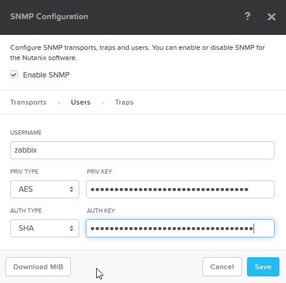

Nutanix Template for Zabbix
###########################
:date: 2016-03-31 17:35
:author: alain
:category: sysadmin
:tags: nutanix, supervision, template, zabbix
:slug: nutanix-template-for-zabbix
:status: published

Cet article est également disponible `en
français <http://blog.devarieux.net/2016/03/template_nutanix_pour_zabbix/>`__

For the needs of our infrastructure, I built a Nutanix Template for the
monitoring plateforme Zabbix. This template automatically discover
containers, CVMs, hard drives, hypervisors and virtual machines.

Once the items are discovered, some metrics, graphs and triggers are
deployed

To be able to use this template, the prism's SNMP server needs to be
configured, the Nutanix MIB needs to be integrated in the zabbix server
and some macros needs to be set at the host level in Zabbix. We will go
through these few steps in the next part of this post.

The template is configured to use SNMPv3 in authPriv mode, using SHA
auth and AES privacy.

Prism Central
-------------

The prism configuration is quite simple, using the SNMP configuration
interface

|2016-03-18 09\_52\_19-Nutanix Web Console|

Make sure at least one Transport is configured in UDP, on the port of
your choice (161 by default)

|2016-03-18 09\_52\_56-Nutanix Web Console|

Then, go in the 'Users' tab and add a new user for Zabbix.

|2016-03-18 09\_53\_41-Nutanix Web Console|

While you are here, you can download the MIB, we will need it later.

Clic Save. The prim configuration is done.

Nutanix MIB
-----------

One you have downloaded the Nutanix MIB, we need to upload it on the
Zabbix server. On CentOS, it is located in /usr/share/snmp/mibs

::

    # ls /usr/share/snmp/mibs/NUTANIX*
    /usr/share/snmp/mibs/NUTANIX-MIB

Restart Zabbix so it can use this new MIB

::

    # systemctl restart zabbix-server

You can test the MIB and the prism configuration using the snmpwalk
command line tool. In the example, we are listing all the Nutanix
containers.

::

    snmpwalk -v 3 -a SHA -A YOURSHAPASSWORD -u zabbix -x AES -X YOURAESPASSWORD IP.OF.PRISM.CENTRAL -l AuthPriv citContainerName
    NUTANIX-MIB::citContainerName.1 = STRING: container00.
    NUTANIX-MIB::citContainerName.2 = STRING: containerA.
    NUTANIX-MIB::citContainerName.3 = STRING: containerB.
    NUTANIX-MIB::citContainerName.4 = STRING: containerC.
    NUTANIX-MIB::citContainerName.5 = STRING: RESERVED_SPACE.
    NUTANIX-MIB::citContainerName.6 = STRING: containerD.

The server configuration is done, we can now configure Zabbix itself.

Zabbix
------

If it's not already done, create a new host for prism central in Zabbix.
The host needs 3 macros for the Nutanix Template to work on it.

Those 3 macros are

-  {$NTX\_SNMP\_USER} : the SNMP user
-  {$NTX\_SNMP\_AUTH} : the SHA password
-  {$NTX\_SNMP\_PRIV} : the AES password

Then, import this
`Template <http://blog.devarieux.net/wp-content/uploads/2016/03/Template_SNMP_Nutanix_Cluster.xml>`__
in Zabbix and apply it on your prism central host.

By default, the VM discovery is disabled because I couldn't find a good
way to create hosts from the LLD process.

If you have a big Nutanix cluster and Zabbix shows a timeout error while
parsing the SNMP OIDs, you can increase this timeout in the Zabbix
configuration file

::

    Timeout=10

Known bugs :

-  Until NOS 4.6, LLD can't discover all hypervisors. This behavior is
   the same when using snmpwalk. I guess this is a Nutanix problem.
   Everything works fine in NOS 4.6
-  The number of found VMs is limited to 250. I guess this is a
   limitation on the Nutanix side.

.. |2016-03-18 09_52_56-Nutanix Web Console| image:: images/2016/03/2016-03-18-09_52_56-Nutanix-Web-Console.png

