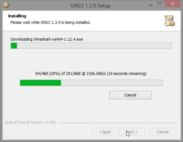

Prise en main de GNS3 pour la simulation réseau
###############################################
:date: 2015-08-19 21:57
:author: aldevar
:category: network
:slug: prise-en-main-de-gns3-pour-la-simulation-reseau
:status: published

Comme moi, vous connaissez peut être l'utilitaire `Packet Tracer de
Cisco <https://www.netacad.com/about-networking-academy/packet-tracer>`__
qui permet de simuler un réseau Cisco et d'y faire quelques exercices.
C'est un très bon outil pour les étudiants mais relativement peu
exploitable en entreprise car il ne simule que du Cisco et ne sais pas
simuler autre chose que des hôtes très basiques. Impossible d'y simuler
un serveur pfsense par exemple.

J'ai récemment fait la découverte de GNS3 qui est un logiciel assez
similaire mais vous vous en doutez bien plus complet et qui possède la
capacité de simuler un réseau de production. Vous pouvez créer des
projets avec switchs et routeurs mais également ajouter des VMs que vous
aurez pris le soin de créer avec VirtualBox ou Qemu. Wireshark est
intégré afin de capturer des paquets réseau comme on le souhaite.

GNS3 a vu le jour suite à l'apparition de Dynamips, un émulateur de l'OS
de Cisco : IOS (à ne pas confondre avec l'iOS d'Apple). Dynamips est un
outil qui se manipule en ligne de commande et qui demande un solide
bagage technique. GNS3 a alors été développé pour faciliter cette
configuration et apporter beaucoup d'autres fonctionnalités qui ne sont
pas présentes dans Dynamips comme par exemple le support de Cisco PIX et
ASA, ainsi que de Juniper avec JunOS.

Avant de commencer, il faut noter que la seule façon de simuler un vrai
environnement IOS est de posséder une image d'IOS. Dynamips et GNS3 ne
contiennent pas ces images pour d'évidents problèmes de droits, tout
comme VirtualBox ne vous propose pas d'image Windows. Il y a plusieurs
façon légales de se procurer ces images (par exemple si vous possédez un
switch ou un routeur Cisco) et d'autres moins légales (trouvable
facilement).

Pour récupérer la dernière version de GNS3 (v1.3.9 aujourd'hui), vous
devez vous inscrire `sur leur site <http://www.gns3.com/>`__ et
télécharger le paquet qu'il vous faut. L'appli est multiplateforme,
compatible Windows, Linux et Mac. L'installeur va installer pour vous
tous les outils nécessaire pour la virtualisation et la capture de
paquets.

|2015-08-17 23\_30\_55-GNS3 1.3.9 Setup|

Sous Windows, l'installation
est assez classique. Après avoir lancé l'installeur, la fenêtre de setup
apparaît, il suffit alors de suivre les indications jusqu'à arriver à
cette fenêtre :

|2015-08-17 23\_33\_08-GNS3 1.3.9 Setup|

Il est préférable de laisser
tout cocher, ainsi si des logiciels ont besoin de mise à jour, elles
seront faites. En cliquant sur Next, l'installeur va lancer
l'installation de winPcap

|2015-08-17 23\_33\_29-WinPcap 4.1.3 Setup|

|2015-08-17 23\_33\_42-WinPcap 4.1.3 Setup|

On laisse cocher le lancement automatique du driver au démarrage.

Ensuite, l'installeur télécharge et installe Wireshark

|2015-08-17 23\_33\_59-GNS3 1.3.9 Setup| |2015-08-17
23\_34\_14-Wireshark 1.12.4 (64-bit) Setup| |2015-08-17
23\_34\_39-Wireshark 1.12.4 (64-bit) Setup|

WinPcap est déjà installé donc on décoche l'option
|2015-08-1723\_34\_56-Wireshark 1.12.4 (64-bit) Setup| |2015-08-17
23\_35\_47-Wireshark 1.12.4 (64-bit) Setup|

On décoche 'Run Wireshark',
on ne va pas en avoir besoin tout de suite.

 

L'installation se poursuit avec cette fois SolarWinds Response Time
Viewer qui est une application d'analyse de capture Wireshark

|2015-08-17 23\_37\_13-SolarWinds Registration| 

Ici, vous pouvez mettre ce que vous voulez, l'adresse n'est pas vérifiée

|2015-08-17 23\_38\_54-SolarWinds Response Time Viewer for Windows| 

L'application se lance automatiquement. Je vous invite à en
faire un tour rapide avant de la fermer

|2015-08-17 23\_40\_09-GNS3 1.3.9 Setup| |2015-08-17 23\_40\_30-GNS3
1.3.9 Setup| 

SolarWinds vous propose une licence gratuite pour son
software. Je n'ai pas testé comment acquérir cette licence et je ne sais
pas sous quelle condition elle s'acquière.

Voilà pour la description et l'installation de GNS3. La prochaine fois,
on verra comment le configurer et y créer de nouveau routeur, switchs et
VM.

 

.. |2015-08-17 23_33_29-WinPcap 4.1.3 Setup| image:: images/2015-08-17-23_33_29-WinPcap-4.1.3-Setup-300x233.png
   :target: images/2015-08-17-23_33_29-WinPcap-4.1.3-Setup.png

.. |2015-08-17 23_34_14-Wireshark 1.12.4 (64-bit) Setup| image:: images/2015-08-17-23_34_14-Wireshark-1.12.4-64-bit-Setup-300x233.png
   :target: images/2015-08-17-23_34_14-Wireshark-1.12.4-64-bit-Setup.png
.. |2015-08-17 23_34_39-Wireshark 1.12.4 (64-bit) Setup| image:: images/2015-08-17-23_34_39-Wireshark-1.12.4-64-bit-Setup-300x233.png
   :target: images/2015-08-17-23_34_39-Wireshark-1.12.4-64-bit-Setup.png

.. |2015-08-17 23_37_13-SolarWinds Registration| image:: images/2015-08-17-23_37_13-SolarWinds-Registration-300x168.png
   :target: images/2015-08-17-23_37_13-SolarWinds-Registration.png
.. |2015-08-17 23_38_54-SolarWinds Response Time Viewer for Windows| image:: images/2015-08-17-23_38_54-SolarWinds-Response-Time-Viewer-for-Windows-300x213.png
   :target: images/2015-08-17-23_38_54-SolarWinds-Response-Time-Viewer-for-Windows.png
.. |2015-08-17 23_40_09-GNS3 1.3.9 Setup| image:: images/2015-08-17-23_40_09-GNS3-1.3.9-Setup-300x233.png
   :target: images/2015-08-17-23_40_09-GNS3-1.3.9-Setup.png

